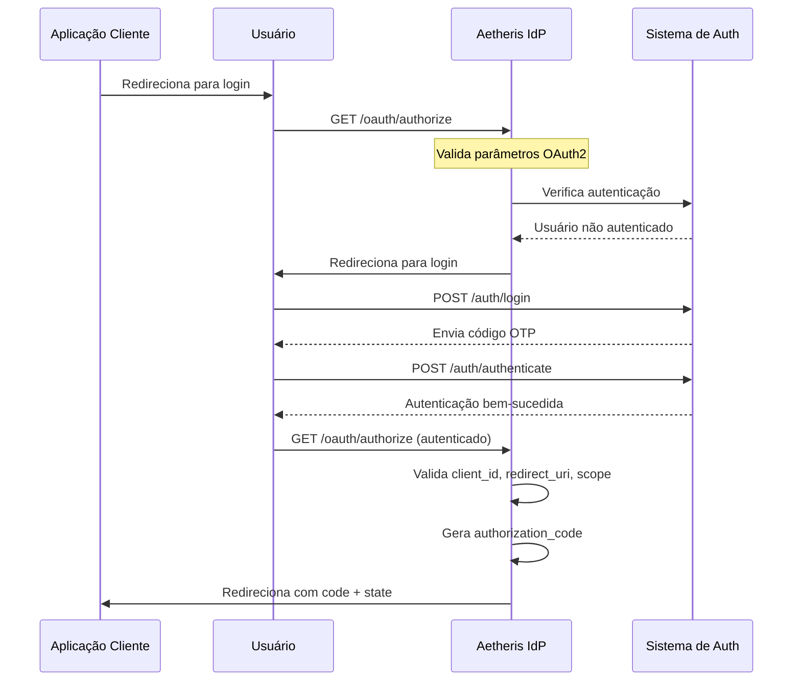
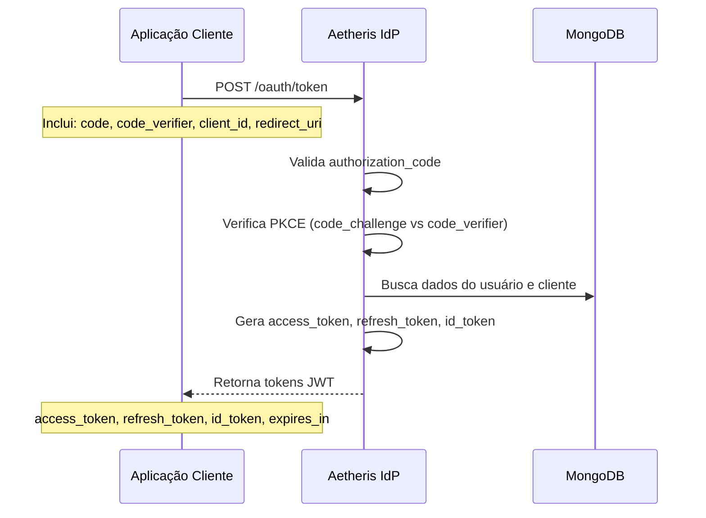

# Sistema OAuth2 - Aetheris Identity Provider

## Visão Geral

Este projeto implementa um **Identity Provider (IdP) OAuth2** completo e seguro, focado em fornecer autenticação e autorização robusta para aplicações web e móveis. O sistema implementa o fluxo OAuth2 **Authorization Code** com **PKCE (Proof Key for Code Exchange)** para máxima segurança.

## Objetivo do Projeto

O **Aetheris Identity Provider** tem como objetivo principal:

- **Centralizar a autenticação** de usuários em um único sistema
- **Implementar OAuth2** seguindo as melhores práticas de segurança
- **Suportar múltiplos clientes** (aplicações) com diferentes níveis de acesso
- **Fornecer tokens JWT** seguros para autenticação de API
- **Implementar PKCE** para prevenir ataques de interceptação de código
- **Gerenciar escopos granulares** para controle de acesso detalhado
- **Suportar OpenID Connect** para identidade federada

## Arquitetura do Sistema

### Tecnologias Utilizadas

- **Backend**: Go 1.24.2 com Echo framework
- **Banco de Dados**: MongoDB 7.0
- **Autenticação**: JWT + OTP (One-Time Password)
- **Containerização**: Docker + Docker Compose
- **Injeção de Dependência**: Uber Dig
- **Validação**: Go Playground Validator
- **Testes**: Testify + Mocks

### Estrutura do Projeto

```
backend/
├── cmd/api/           # Ponto de entrada da aplicação
├── internal/          # Lógica interna da aplicação
│   ├── api/          # Utilitários da API (validação, resposta, erro)
│   ├── bootstrap/    # Configuração e inicialização
│   ├── domain/       # Entidades e regras de negócio
│   ├── handlers/     # Controladores HTTP
│   ├── middlewares/  # Middlewares de autenticação e autorização
│   ├── models/       # Modelos de dados e DTOs
│   ├── repositories/ # Camada de acesso a dados
│   ├── server/       # Configuração do servidor HTTP
│   └── services/     # Lógica de negócio
├── pkg/              # Pacotes reutilizáveis
├── configs/          # Configurações da aplicação
├── infra/            # Infraestrutura (banco de dados)
└── mocks/            # Mocks para testes
```

## Fluxo OAuth2 Authorization Code com PKCE

### 1. Fluxo de Autorização



### 2. Fluxo de Troca de Token



### 3. Parâmetros OAuth2 Suportados

#### Endpoint de Autorização (`/oauth/authorize`)

| Parâmetro               | Obrigatório | Descrição                                  |
| ----------------------- | ----------- | ------------------------------------------ |
| `client_id`             | Sim         | Identificador único do cliente OAuth2      |
| `redirect_uri`          | Sim         | URI de redirecionamento após autorização   |
| `response_type`         | Sim         | Deve ser `code` para Authorization Code    |
| `scope`                 | Sim         | Escopos solicitados (separados por espaço) |
| `state`                 | Sim         | Valor para prevenir ataques CSRF           |
| `code_challenge`        | Sim         | Hash do code_verifier para PKCE            |
| `code_challenge_method` | Sim         | Método de hash (S256 recomendado)          |

#### Endpoint de Token (`/oauth/token`)

| Parâmetro       | Obrigatório | Descrição                      |
| --------------- | ----------- | ------------------------------ |
| `code`          | Sim         | Código de autorização recebido |
| `code_verifier` | Sim         | Verificador PKCE original      |
| `client_id`     | Sim         | ID do cliente OAuth2           |
| `redirect_uri`  | Sim         | URI de redirecionamento        |

## Escopos Disponíveis

### Escopos de Usuário

- `profile:read` - Leitura de informações públicas do perfil
- `profile:write` - Modificação de informações do perfil
- `password:write` - Alteração da própria senha
- `account:delete:self` - Exclusão da própria conta

### Escopos de Notificações

- `notifications:read` - Leitura de notificações
- `notifications:write` - Gerenciamento de notificações

### Escopos OpenID Connect

- `openid` - Identificação OpenID Connect

### Escopos Administrativos

- `users:read`, `users:create`, `users:update`, `users:delete`
- `clients:read`, `clients:create`, `clients:update`, `clients:delete`

## Segurança Implementada

### PKCE (Proof Key for Code Exchange)

- **Code Challenge**: Hash SHA256 do code_verifier
- **Code Verifier**: String aleatória de 43-128 caracteres
- **Prevenção**: Ataques de interceptação de código

### Validações de Segurança

- Verificação de `client_id` válido
- Validação de `redirect_uri` registrada
- Verificação de escopos autorizados
- Expiração de códigos de autorização
- Validação de `state` para CSRF

### Tokens JWT

- **Access Token**: Acesso a recursos protegidos
- **Refresh Token**: Renovação de tokens expirados
- **ID Token**: Informações de identidade do usuário
- **Expiração**: Controle de tempo de vida dos tokens

## Como Executar

### Pré-requisitos

- Go 1.24.2+
- Docker e Docker Compose
- MongoDB (via Docker)

### 1. Clonar o Repositório

```bash
git clone <repository-url>
cd o-auth2
```

### 2. Configurar Variáveis de Ambiente

```bash
cd backend
cp .env.example .env
# Editar .env com suas configurações
```

### 3. Executar com Docker Compose

```bash
docker-compose up -d
```

### 4. Executar a Aplicação

```bash
cd backend
go mod download
go run cmd/api/main.go
```

### 5. Verificar Saúde do Sistema

```bash
curl http://localhost:8080/api/dev/health
```

## Endpoints da API

### OAuth2

- `GET /api/oauth/authorize` - Iniciar fluxo de autorização
- `POST /api/oauth/token` - Trocar código por tokens

### Autenticação

- `POST /api/auth/login` - Login do usuário
- `POST /api/auth/register` - Registro de usuário
- `POST /api/auth/authenticate` - Autenticação OTP
- `POST /api/auth/code/resend` - Reenvio de código OTP

### Clientes

- `POST /api/clients` - Criar novo cliente OAuth2

### Desenvolvimento

- `GET /api/dev/health` - Status da aplicação
- `GET /api/dev/envs` - Variáveis de ambiente

## Exemplo de Uso

### 1. Criar Cliente OAuth2

```bash
curl -X POST http://localhost:8080/api/clients \
  -H "Content-Type: application/json" \
  -d '{
    "client_id": "meu-app",
    "client_secret": "secret123",
    "redirect_uris": ["https://meu-app.com/callback"],
    "scopes": ["profile:read", "openid"]
  }'
```

### 2. Iniciar Fluxo de Autorização

```
GET /api/oauth/authorize?
  client_id=meu-app&
  redirect_uri=https://meu-app.com/callback&
  response_type=code&
  scope=profile:read openid&
  state=abc123&
  code_challenge=hash_do_code_verifier&
  code_challenge_method=S256
```

### 3. Trocar Código por Token

```bash
curl -X POST http://localhost:8080/api/oauth/token \
  -H "Content-Type: application/x-www-form-urlencoded" \
  -d "code=AUTHORIZATION_CODE&code_verifier=CODE_VERIFIER&client_id=meu-app&redirect_uri=https://meu-app.com/callback"
```

## Estrutura do Banco de Dados

### Coleções MongoDB

- **users**: Usuários do sistema
- **clients**: Clientes OAuth2 registrados
- **authorization_codes**: Códigos de autorização temporários
- **refresh_tokens**: Tokens de renovação
- **otps**: Códigos OTP para autenticação

## Testes

### Executar Testes

```bash
cd backend
go test ./...
```

### Executar Testes com Cobertura

```bash
go test -coverprofile=coverage.out ./...
go tool cover -html=coverage.out
```
